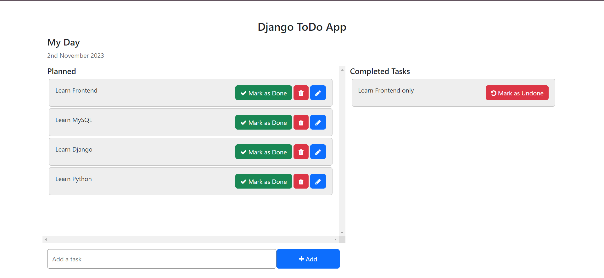

# To-Do App Django

## Overview
This Django To-Do app is designed to help you manage your tasks and to-do lists efficiently. It provides essential features like adding tasks, marking tasks as completed, editing task details, and deleting tasks.


## Features

1. Home View
    The home view displays a list of tasks, categorizing them into "Pending Tasks" and "Completed Tasks." This view serves as the main interface for managing your to-do list.

    

2. Add Task
    The "Add Task" feature allows you to create a new task. Simply enter the task description and click "Add" to include it in your to-do list.

    

3. Mark Task as Done
    You can mark a task as completed by clicking the "Mark as Done" button next to the task. Completed tasks are moved to the "Completed Tasks" section.

    

4. Mark Task as Undone
    If you mistakenly marked a task as completed, you can undo this action by clicking the "Mark as Undone" button. The task is then moved back to the "Pending Tasks" section.

    

5. Edit Task
    Need to update the details of a task? Click the "Edit" button next to the task, make your changes, and save the updated task.

    

6. Delete Task
    Tasks you no longer need can be deleted from your to-do list. Click the "Delete" button to remove a task permanently.

    

## Getting Started

**Installation:** Ensure you have Django installed. If not, you can install it using pip:
```
pip install Django
Clone the Repository: Clone this project's repository to your local machine.
```

**Database Setup:** Configure your database settings in the project's settings.py file. Run migrations to create the necessary database tables:
```
python manage.py makemigrations
python manage.py migrate
```

**Run the Development Server:** Start the Django development server:
```
python manage.py runserver
```

**Access the Application:** Open your web browser and navigate to http://127.0.0.1:8000/ to access the Django To-Do App.

## Contributing
Contributions are welcome! If you would like to enhance or expand upon this project, please fork the repository and submit your pull requests.

## License
This project is open-source and available under the NO License. Feel free to use, modify, and distribute it as needed.

## Contact
For any questions or feedback, please contact [Arun Kumar](arun.kumar.2403gg@gmail.com).